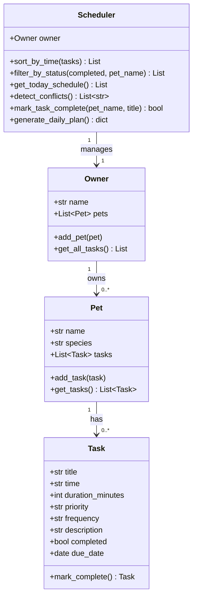

# 🐾 PawPal+

A smart daily pet care scheduling app built with Python and Streamlit.

## Overview

PawPal+ helps busy pet owners stay consistent with their pets' care routines. The system tracks tasks (walks, feeding, medications, grooming, etc.), organizes them by priority and time, detects scheduling conflicts, and handles recurring tasks automatically.

## Features

- **Owner & Pet Management** — Add multiple pets with name and species
- **Task Tracking** — Each task stores title, time, duration, priority, frequency, description, and due date
- **Smarter Scheduling**
  - **Priority-first sorting** — High-priority tasks (e.g., medications) surface first; ties broken by time
  - **Time-based sorting** — All tasks displayed chronologically within each priority level
  - **Conflict detection** — Warns when two tasks share the exact same time on the same day
  - **Recurring tasks** — Daily and weekly tasks auto-reschedule to the next occurrence when marked complete
  - **Status filtering** — Filter the task list by completion status and/or pet name
- **Daily Plan view** — Explains why each task is ranked where it is
- **All Tasks view** — Sortable, filterable table across all pets

## Setup

```bash
python -m venv .venv
# Windows:
.venv\Scripts\activate
# macOS/Linux:
source .venv/bin/activate

pip install -r requirements.txt
streamlit run app.py
```

## CLI Demo

Run the backend logic directly in the terminal to verify scheduling behavior:

```bash
python main.py
```

## System Architecture (UML)



## Testing PawPal+

```bash
python -m pytest
```

The test suite (`tests/test_pawpal.py`) covers:

| Test area | What is verified |
|---|---|
| Task completion | `mark_complete()` sets `completed = True` |
| Task addition | `pet.add_task()` grows the task list |
| Sorting correctness | `sort_by_time()` returns HH:MM chronological order across multiple pets |
| Recurrence — daily | Completing a daily task creates a new task due tomorrow |
| Recurrence — weekly | Completing a weekly task creates a new task due in 7 days |
| Recurrence — once | One-time tasks produce no follow-up |
| Scheduler recurrence | `mark_task_complete()` appends the next occurrence to the pet |
| Conflict detection | Two tasks at the same time/date trigger a warning |
| No false conflicts | Same time on *different* dates is not flagged |
| Status filter | `filter_by_status(completed=False)` excludes completed tasks |
| Pet name filter | `filter_by_status(pet_name=...)` returns only that pet's tasks |

**Confidence level: ⭐⭐⭐⭐ (4/5)**

Core scheduling behaviors are well-covered. Not yet tested: empty-pet edge cases, time-zone handling, and duration-overlap conflicts.

## 📸 Demo

<!-- Replace with your screenshot after running: streamlit run app.py -->
<a href="/course_images/ai110/pawpal_screenshot.png" target="_blank">
  
</a>
